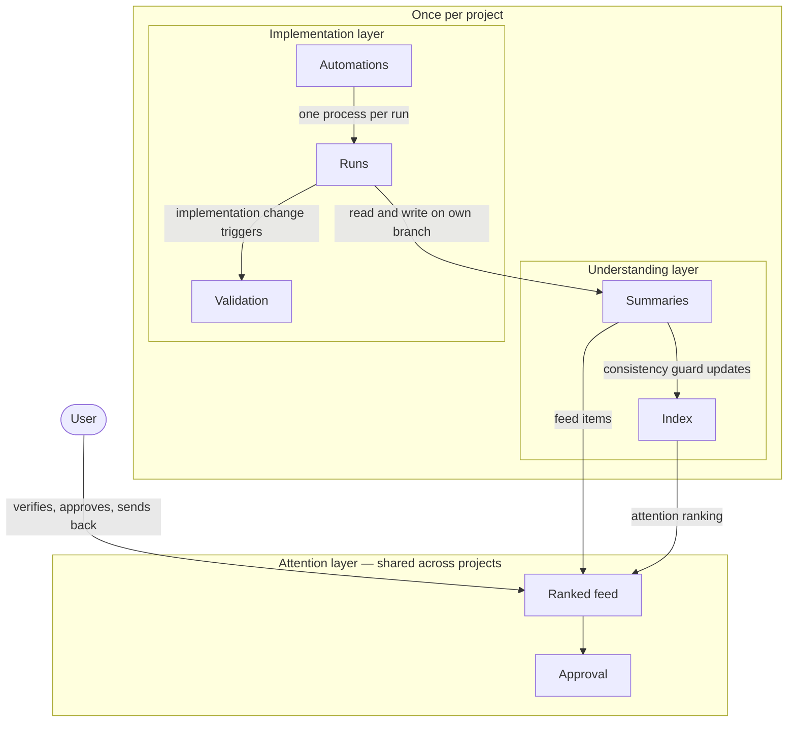

# Layers

Source: [SPEC.md → Dictionary: Layers](../SPEC.md#dictionary), [Components](../SPEC.md#components)

```mermaid
flowchart TB
  User(["User"])
  subgraph Attention["Attention layer — shared across projects"]
    Feed["Ranked feed"]
    Approval["Approval"]
  end
  subgraph PerProject["Once per project"]
    subgraph Understanding["Understanding layer"]
      Summaries["Summaries"]
      Index["Index"]
    end
    subgraph Implementation["Implementation layer"]
      Automations["Automations"]
      Runs["Runs"]
      Validation["Validation"]
    end
  end
  User -->|"verifies, approves, sends back"| Feed
  Feed --> Approval
  Summaries -->|"feed items"| Feed
  Index -->|"attention ranking"| Feed
  Summaries -->|"consistency guard updates"| Index
  Automations -->|"one process per run"| Runs
  Runs -->|"read and write on own branch"| Summaries
  Runs -->|"implementation change triggers"| Validation
```
