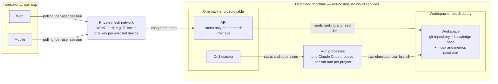

# Deployment and remote access

Source: [SPEC.md → Deployment](../SPEC.md#deployment), [Remote access](../SPEC.md#remote-access), [Orchestrator](../SPEC.md#orchestrator)

```mermaid
flowchart LR
  subgraph FrontEnd["Front-end — one app"]
    Web["Web"]
    Mobile["Mobile"]
  end
  Mesh["Private mesh network<br/>WireGuard, e.g. Tailscale<br/>one key per enrolled device"]
  subgraph Machine["Dedicated machine — self-hosted, no cloud services"]
    subgraph Backend["One back-end deployable"]
      API["API<br/>listens only on the mesh interface"]
      Orch["Orchestrator"]
    end
    Runs["Run processes<br/>one Claude Code process per run and per project"]
    subgraph Root["Workspaces root directory"]
      WS["Workspace<br/>git repository + knowledge base<br/>+ index and metrics database"]
    end
  end
  Web -->|"polling, per-user session"| Mesh
  Mobile -->|"polling, per-user session"| Mesh
  Mesh -->|"encrypted tunnel"| API
  API -->|"reads ranking and feed order"| WS
  Orch -->|"starts and supervises"| Runs
  Runs -->|"own checkout, own branch"| WS
```
