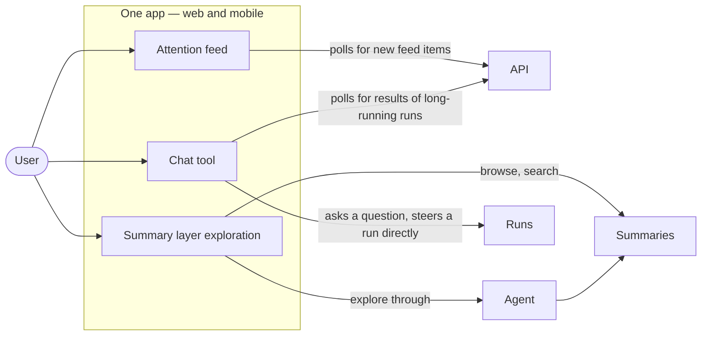

# Front-end

Source: [SPEC.md → Front-end](../SPEC.md#front-end), [API](../SPEC.md#api)

```mermaid
flowchart LR
  User(["User"])
  subgraph App["One app — web and mobile"]
    Feed["Attention feed"]
    Chat["Chat tool"]
    Explore["Summary layer exploration"]
  end
  API["API"]
  Summaries["Summaries"]
  Agent["Agent"]
  Runs["Runs"]
  User --> Feed
  User --> Chat
  User --> Explore
  Feed -->|"polls for new feed items"| API
  Chat -->|"asks a question, steers a run directly"| Runs
  Chat -->|"polls for results of long-running runs"| API
  Explore -->|"browse, search"| Summaries
  Explore -->|"explore through"| Agent
  Agent --> Summaries
```
