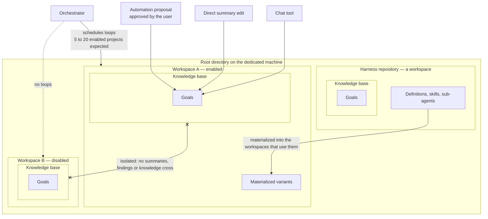

# Workspaces and projects

Source: [SPEC.md → Workspaces and projects](../SPEC.md#workspaces-and-projects), [Automations → Optimization](../SPEC.md#automations)

```mermaid
flowchart TB
  Orch["Orchestrator"]
  ChatTool["Chat tool"]
  DirectEdit["Direct summary edit"]
  Proposal["Automation proposal<br/>approved by the user"]
  subgraph Root["Root directory on the dedicated machine"]
    subgraph Harness["Harness repository — a workspace"]
      subgraph HKB["Knowledge base"]
        HGoals["Goals"]
      end
      HDefs["Definitions, skills, sub-agents"]
    end
    subgraph WA["Workspace A — enabled"]
      subgraph AKB["Knowledge base"]
        AGoals["Goals"]
      end
      AVariants["Materialized variants"]
    end
    subgraph WB["Workspace B — disabled"]
      subgraph BKB["Knowledge base"]
        BGoals["Goals"]
      end
    end
  end
  Orch -->|"schedules loops<br/>5 to 20 enabled projects expected"| WA
  Orch -. "no loops" .-> WB
  ChatTool --> AGoals
  DirectEdit --> AGoals
  Proposal --> AGoals
  HDefs -->|"materialized into the workspaces that use them"| AVariants
  AKB x--x|"isolated: no summaries, findings or knowledge cross"| BKB
```
