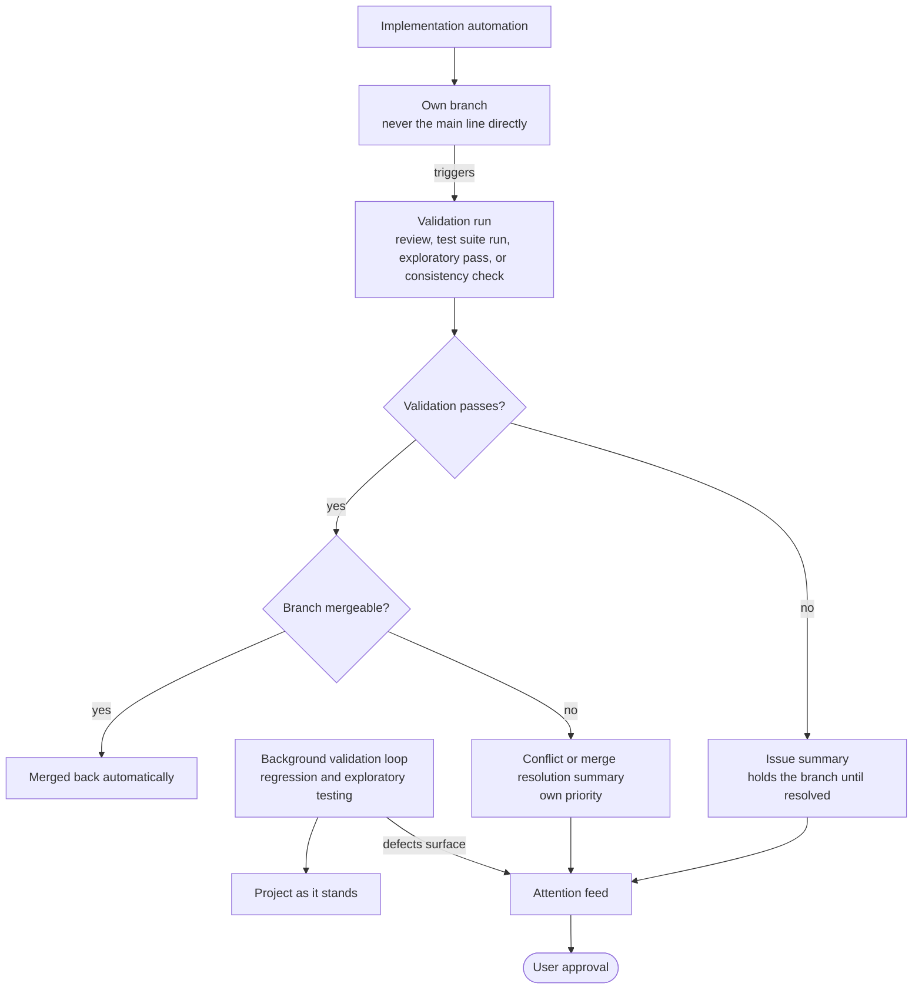

# Implementation and validation

Source: [SPEC.md → Automations: Implementation, Validation](../SPEC.md#automations)

```mermaid
flowchart TB
  Impl["Implementation automation"]
  Branch["Own branch<br/>never the main line directly"]
  Val["Validation run<br/>review, test suite run, exploratory pass, or consistency check"]
  Pass{"Validation passes?"}
  Mergeable{"Branch mergeable?"}
  Merged["Merged back automatically"]
  IssueS["Issue summary<br/>holds the branch until resolved"]
  Conflict["Conflict or merge resolution summary<br/>own priority"]
  Loop["Background validation loop<br/>regression and exploratory testing"]
  Project["Project as it stands"]
  Feed["Attention feed"]
  User(["User approval"])
  Impl --> Branch -->|"triggers"| Val --> Pass
  Pass -->|"yes"| Mergeable
  Pass -->|"no"| IssueS --> Feed
  Mergeable -->|"yes"| Merged
  Mergeable -->|"no"| Conflict --> Feed
  Loop --> Project
  Loop -->|"defects surface"| Feed
  Feed --> User
```
