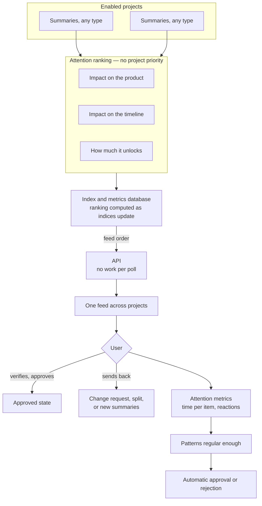

# Attention feed

Source: [SPEC.md → Attention feed](../SPEC.md#attention-feed), [Index and metrics database](../SPEC.md#index-and-metrics-database)

```mermaid
flowchart TB
  subgraph Enabled["Enabled projects"]
    SA["Summaries, any type"]
    SB["Summaries, any type"]
  end
  subgraph Ranking["Attention ranking — no project priority"]
    P["Impact on the product"]
    T["Impact on the timeline"]
    U["How much it unlocks"]
  end
  Index["Index and metrics database<br/>ranking computed as indices update"]
  API["API<br/>no work per poll"]
  Feed["One feed across projects"]
  User{"User"}
  Main["Approved state"]
  Back["Change request, split,<br/>or new summaries"]
  AttM["Attention metrics<br/>time per item, reactions"]
  Patterns["Patterns regular enough"]
  Auto["Automatic approval or rejection"]
  SA --> Ranking
  SB --> Ranking
  Ranking --> Index -->|"feed order"| API --> Feed --> User
  User -->|"verifies, approves"| Main
  User -->|"sends back"| Back
  User --> AttM --> Patterns --> Auto
```
