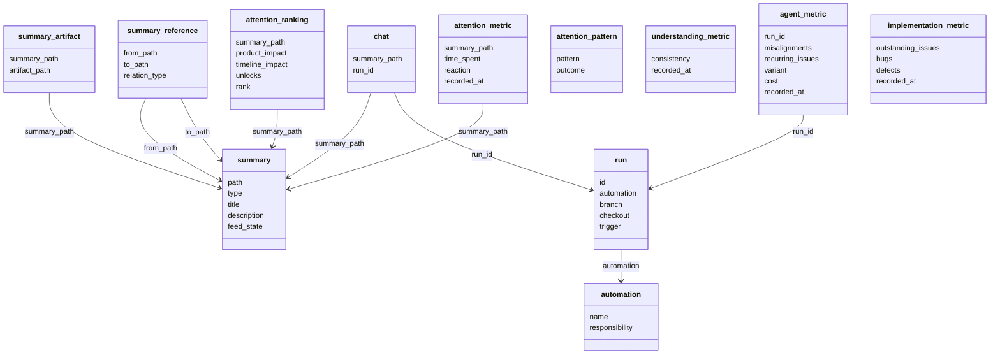

# Database

Source: [SPEC.md → Database](../SPEC.md#database)

```mermaid
classDiagram
  class summary {
    path
    type
    title
    description
    feed_state
  }
  class summary_artifact {
    summary_path
    artifact_path
  }
  class summary_reference {
    from_path
    to_path
    relation_type
  }
  class chat {
    summary_path
    run_id
  }
  class automation {
    name
    responsibility
  }
  class run {
    id
    automation
    branch
    checkout
    trigger
  }
  class attention_ranking {
    summary_path
    product_impact
    timeline_impact
    unlocks
    rank
  }
  class attention_metric {
    summary_path
    time_spent
    reaction
    recorded_at
  }
  class attention_pattern {
    pattern
    outcome
  }
  class understanding_metric {
    consistency
    recorded_at
  }
  class agent_metric {
    run_id
    misalignments
    recurring_issues
    variant
    cost
    recorded_at
  }
  class implementation_metric {
    outstanding_issues
    bugs
    defects
    recorded_at
  }
  summary_artifact --> summary : summary_path
  summary_reference --> summary : from_path
  summary_reference --> summary : to_path
  chat --> summary : summary_path
  chat --> run : run_id
  run --> automation : automation
  attention_ranking --> summary : summary_path
  attention_metric --> summary : summary_path
  agent_metric --> run : run_id
```
