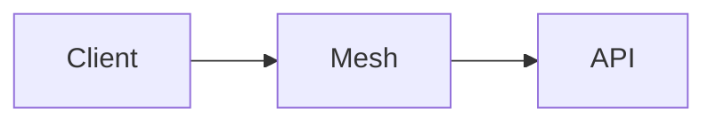

# Momentum implementation plan

Source: [SPEC.md](SPEC.md), [entity-types.tsv](entity-types.tsv), [diagrams](diagrams/), [designs](designs/pages.html)

The infrastructure is built in one pass. Work packages below are ordered by dependency, not delivered as slices.

## Technology decisions

| Area | Decision | Driven by |
|---|---|---|
| Language | TypeScript everywhere, Node 24 LTS, pnpm workspaces monorepo | Claude Code and the Claude Agent SDK are Node; one language across front-end, API, orchestrator, guard and automations |
| Front-end | Expo (React Native) with Expo Router; web target through react-native-web, served as static files by the back-end | One app, written once, deployed to web and mobile |
| Gestures | react-native-gesture-handler + react-native-reanimated | Swipe right to approve, swipe left to disapprove with a comment |
| Polling | TanStack Query with `refetchInterval`; no sockets | Front-end polls for feed items and run results; no persistent push channel |
| Markdown and diagrams | Cards rendered from markdown AST; mermaid diagrams rendered to SVG on the server by the guard (mermaid-isomorphic through Playwright, in the Edge that ships with Windows; labels as SVG text), shown with react-native-svg on mobile and as an image on web | A card may carry a diagram; no WebView on mobile |
| Back-end | Fastify + zod, one process: API, orchestrator, consistency guard | One back-end deployable, only runs as separate processes |
| Runs | Claude Agent SDK (`@anthropic-ai/claude-agent-sdk`), one subprocess per run, cwd = the run's checkout | Claude Code as a first-class citizen; one Claude Code process per run and per project |
| Run isolation | `git worktree` per run under `C:\Projects\.runs\<workspace>\<run-id>`, branch `momentum/<automation>/<run-id>`; the process is placed in a Windows job object with CPU and memory limits by procgov as soon as it starts, so everything it starts inherits the job; killed with its process tree | Own checkout, own branch, isolated, killable, own resource limits |
| Knowledge base files | Markdown at `knowledge-graph/<type path>/<name>.md` on the workspace main line; frontmatter carries type, references and ranking parameters; body is the card, free-form markdown within the configured character limit | Card limit and on-disk layout fixed by the spec |
| Parser and validator | unified: remark-parse, remark-gfm, remark-frontmatter; validator enforces the configured character limit and resolves references | Validation covers the card limit and the references between entities |
| Index and metrics database | Postgres 18 in Docker on this machine (`pgvector/pgvector:pg18-trixie`), database `momentum`, one schema per workspace (`ws_<workspace>`); postgres.js driver; `tsvector` + GIN for search, pgvector for embeddings | One self-hosted store per workspace, not a managed service |
| Graph RAG retrieval | `ts_rank` full text + pgvector cosine + reference traversal over `entity_reference` (recursive CTE); embeddings computed in-process with `@huggingface/transformers` (bge-small, ONNX) | Graph RAG over entity types; no cloud service beyond the Anthropic API |
| KB access for runs | An in-process MCP server `momentum-kb` (search, read, references, write, record_agent_metric) given to every run by the SDK, and `momentum-run` (report_validation) for the validation automation | Agents and automations read and write the knowledge base freely on their own branch |
| Consistency guard | Claude Code hooks in every run: PostToolUse validates each knowledge-base write as it happens, Stop sends the run back to fix changes the guard would not accept; chokidar watch on `knowledge-graph/` of every run checkout for changes made outside the tools; a transaction is the set of changes of one run; index update per validated transaction | Reacts to every change, groups related changes, updates the index |
| Attention ranking | `product_impact`, `timeline_impact`, `unlocks` are integers 0–5 in entity frontmatter, written by the automation or user that authored the entity; `rank` = product_impact + timeline_impact + unlocks, a generated column computed when the index is updated; ties go to the item that entered the feed first | Ranking derived from the entities themselves; API reads the feed order with no work per poll |
| Cross-project feed | API merges the per-workspace `attention_ranking` tables of enabled projects by rank at request time, one `UNION ALL` across their schemas | One feed across projects, adjusting to the enabled set |
| Harness settings | Schema `harness` in the same Postgres database: enabled projects and the state of their knowledge graph build, feed size, lifetime rules, card configuration (character limit, presentation rules), concurrency, sessions, the workspace of every run id, usage readings | Enabling a project must not create commits in it |
| Authentication | Single user; password generated at install into `C:\Projects\.momentum\password.txt` (`pnpm momentum generate-password`), or chosen with `pnpm momentum set-password`; session token in an httpOnly cookie on web and SecureStore on mobile, as a bearer token for MCP; API listens only on the Tailscale interface, `MOMENTUM_HOST` overrides it for local testing | Per-user session on top of the mesh; no port on the public internet |
| Voice tools | The API doubles as an MCP server (streamable HTTP, `/mcp`, behind the same session) over the same handlers, plus `run_automation` for automations whose trigger allows starting on demand | Every capability reachable without the UI |
| Machine | This machine: Windows 11, workspaces root `C:\Projects`; back-end as a Windows service (WinSW, config in `apps/backend/service/`, running under the user's account for its Claude Code login and git identity), Tailscale for Windows, Claude Code CLI, Node 24 from the Node.js installer, procgov from winget | Self-hosted on the dedicated machine as it is |
| Mobile distribution | Android APK built locally with the Android SDK and sideloaded; iPhone runs the web build installed as a PWA, since iOS cannot be built on Windows | No cloud build service |
| Testing | Vitest for parser, guard, hooks, ranking and orchestrator, against a separate `momentum_test` database; Playwright for the web app; end-to-end runs on a throwaway copy of the harness repository and database | The harness manages itself |

Assumed, not verified: procgov limits hold for the Claude Code subprocess tree.

## Repository layout

```
momentum/
  apps/
    app/                Expo app: web + iOS + Android
    backend/            Fastify API, orchestrator, guard, MCP surface; service/ holds the WinSW config
  packages/
    contract/           zod schemas and types shared by app and backend; generated openapi.json
    entity/             markdown parser, validator, mermaid renderer
    kb/                 Postgres index, full text, pgvector, retrieval
    runs/               Agent SDK wrapper, worktrees, job objects
  automations/          Artifacts of the definition entities: agents, skills, MCP config, one directory per automation
  knowledge-graph/      The harness's own knowledge base; Harness/Automation/ holds the definition entities
  docs/
    designs/            page designs
    diagrams/
    SPEC.md
    PLAN.md
```

A definition entity at `knowledge-graph/Harness/Automation/<name>.md` has its Claude Code files in `automations/<name>/` as artifacts; on approval of the entity they are materialized into every workspace that uses it, under `<workspace>\.claude\`, kept out of git by `.git\info\exclude`. `automations/<name>/trigger.md` is the automation's default trigger entity.

Every run gets its automation's agent file as instructions and the summarization and card definitions as sub-agents.

## Entity file format

````markdown
---
type: Product/Feature
origin: automation
verification: unverified
sync: synced
product_impact: 4
timeline_impact: 2
unlocks: 3
references:
  - to: Governance/Decision/remote-access/private-mesh
    relation: depends_on
artifacts:
  - chats/2026-09-30-remote-access.jsonl
---
# Remote access over a private mesh

No port is exposed to the public internet; clients reach the machine through a WireGuard mesh.

- API listens only on the mesh
- One key per enrolled device

| Layer | Protection |
|---|---|
| Tunnel | End-to-end encryption |


````

Validator rules: the card body is within the configured character limit; `type` is a path from entity-types.tsv and matches the entity's directory; every `references.to` resolves on the transaction's branch.

Frontmatter beyond the fields above:

| Entity type | Fields |
|---|---|
| Harness/Trigger | `automation`, `schedule` (cron), `events` (`entity_ahead`, `implementation_finished`), `on_demand` |
| Harness/Issue | `source`: guard, consistency_check or validation |
| Harness/Automation | `variant`, when competing implementations are compared |

Relations the harness acts on: `implements` (sync), `retires` (retention), `concerns` (issues).

## Work packages

| # | Package | Depends on | Delivers |
|---|---|---|---|
| 0 | Machine | — | Tailscale, Node, Claude Code CLI, procgov, WinSW service, `C:\Projects` as the workspaces root, this repository as the first workspace |
| 1 | Contract | — | zod schemas for entity, feed item, run, chat, metrics, settings; generated OpenAPI |
| 2 | Entity package | 1 | Parser, validator, mermaid renderer, golden fixtures |
| 3 | KB package | 2 | Schema of the tables from SPEC.md per workspace (see Database below), full text, pgvector, embeddings, retrieval, `momentum-kb` MCP server |
| 4 | Runs package | 0 | Worktree lifecycle, Agent SDK session per run, job object limits, kill, usage capture from the SDK as a share of the 5-hour and weekly limits |
| 5 | Consistency guard | 2, 3, 4 | Hooks and watcher per run, transaction grouping, validation, issue entities, sync state, index update, ranking |
| 6 | Orchestrator | 4, 5 | Loops per enabled project, schedule, event and on-demand triggers read from each workspace's trigger entities, feed-size bound, concurrency semaphore, chat runs |
| 7 | API | 1, 3, 6 | Session, feed, approve, send back, entities, search, chats, runs, metrics, settings; MCP surface over the same handlers |
| 8 | Automations | 3, 4 | Eleven definition entities in `knowledge-graph/Harness/Automation/` with artifacts in `automations/`: exploration, preparation, consistency check, retention, implementation, validation, optimization, summarization, card, chat, mapping; a default trigger entity for each of the eight automations that start by schedule, event or on demand (summarization and card run as steps, mapping starts with enabling, so they have none), proposed on a setup branch when a workspace is enabled; materialization on approval |
| 9 | App | 1, 7 | Seven pages below, web and mobile |
| 10 | Metrics | 3, 5, 7 | Attention, understanding, agents, implementation metrics; usage as percentage points of the rolling 5-hour and weekly limits; attention patterns |
| 11 | End-to-end validation | all | The harness repository runs as a workspace on the machine: loops produce feed items, approval lands on the main line, metrics fill |

## Approval and send back

- Two independent states per entity: `verification` (unverified, verified) is the user's judgement; `sync` (synced, entity_ahead, artifact_ahead, updating) is the entity against its artifact or implementation.
- Approve: the entity's file, as it is on its run branch, is committed to the workspace main line with `verification: verified`, together with the entities it `retires` (removed), the entities it `implements` (set `synced`) and its `chats/` artifacts; other changes on the branch wait for their own approval. The commit is made without a working tree; in the checkout that has the main line, only files that were clean are updated. An `attention_metric` row is recorded. An implementable entity (Product/Feature, FeatureRequest, UserStory, DevTask, Bug, TechDebt, Harness/Plan) with no `implements` reference becomes `entity_ahead`: approved, awaiting implementation.
- Send back: the comment starts a chat run on the same branch with the comment as its prompt and the entity as its `target_path`; `sync` is `updating` until that run's transaction is validated. What happens to the entity is decided by the comment, not by a state.
- Implementation run: targets an `entity_ahead` entity, which is `updating` while it runs; the approved result carries an `implements` reference and both become `synced`.
- Artifact change: the guard sets `artifact_ahead` and summarization rewrites the card; `verification` is untouched until the rewrite reaches the feed.
- Implementation branches are merged by validation, not by the feed: approval of the entity and the automatic merge of the branch are separate events. The merge keeps `knowledge-graph/` as it is on the main line, so the branch's entities still reach it through the feed. A failed validation holds the branch; a branch that conflicts raises a Harness/Conflict entity.
- Invalid transaction: the guard writes a Harness/Issue `guard-<run-id>` with `source: guard` on the run's branch, listing what it cannot accept; the invalid changes stay out of the index and the feed.
- Retirement: retention writes a Harness/Plan with `retires` references and deletes the retired files on its branch; approving the plan removes them from the main line.

## Pages

Designs: [designs/pages.html](designs/pages.html), one PNG per page and device in [designs/](designs/).

| Page | Purpose | Source | API |
|---|---|---|---|
| Session | Establish the per-user session | Remote access | `POST /session`, `DELETE /session` |
| Feed | Ranked cards across enabled projects; swipe right approves, swipe left disapproves with a comment | Attention feed, slide 2 | `GET /feed`, `POST /feed/{path}/approve`, `POST /feed/{path}/send-back` |
| Entity | One entity in full: verification, sync, type path, card, references, artifacts | Knowledge base, database | `GET /workspaces/{ws}/entities/{path}` |
| Explorer | Browse a workspace's entities by type path, including the definition and trigger entities, search them, or explore through an agent | Front-end | `GET /workspaces/{ws}/types`, `GET /workspaces/{ws}/search?q=` |
| Chat | Chats per workspace; a conversation attached to a run; steer the run, ask a question, see what it has used, or stop it | Chat tool, Automations → Chat | `GET /workspaces/{ws}/chats`, `POST /workspaces/{ws}/chats`, `GET /runs/{id}`, `POST /runs/{id}/messages`, `POST /runs/{id}/kill` |
| Metrics | Four metric families over time and usage as percentage points of the rolling 5-hour and weekly limits, per workspace | Index and metrics database | `GET /workspaces/{ws}/metrics` |
| Settings | Included projects, each enabled one with its knowledge graph build (state, runs, entities, usage; stop and resume), feed size, cards (character limit, presentation rules), lifetimes, agents | Slide 1, Orchestrator, Automations → Mapping | `GET /settings`, `PUT /settings`, `GET /workspaces/{ws}/mapping`, `PUT /workspaces/{ws}/mapping` |

Also served: `GET /workspaces` for the workspace pickers, `/mcp` for voice tools, `/openapi.json`, and the web build for page loads.

Navigation: five tabs on mobile (Feed, Explorer, Chat, Metrics, Settings), a left rail on web. Entity and the chat conversation open from the tab they belong to. No page carries a title; the tab labels it.

## Decisions on open questions

| Question | Decision |
|---|---|
| How a workspace is added or retired | A git repository under `C:\Projects` is a workspace; deleting the directory retires it; Settings only enables or disables |
| Dedicated agents beyond the automations | None; sub-agents are artifacts of the definition entities, proposed by the optimization automation |
| Where user edits of automations land | Definitions are entities at `knowledge-graph/Harness/Automation/<name>` in the harness workspace, with the Claude Code files in `automations/<name>/` as artifacts; triggers are entities at `knowledge-graph/Harness/Trigger/<name>` in each workspace. Edits and proposals go through a branch, the guard and the feed; the orchestrator reads triggers from each workspace's index; materialization runs on approval of a definition |
| Form of validation per kind of work | Chosen by the validation automation from the change's entity type; the four forms are review, test suite run, exploratory pass, consistency check |
| Sync with sources | Runs read the repository directly; the mapping automation builds the initial graph from the repository when a project is enabled, and the summarization step writes summaries from artifacts on the run branch |
| Claude Code integration surface | Agent SDK for runs, `momentum-kb` MCP for the knowledge base, definitions materialized under `<workspace>\.claude\` on approval |
| Offline mobile | Last polled feed and entities cached by TanStack Query; reactions queue until the mesh is reachable |

## Implementation decisions

| Area | Decision |
|---|---|
| Default triggers | Exploration every two hours; preparation every two hours at half past; validation at 02:00 and on `implementation_finished`; consistency check at 03:00; retention at 04:00; optimization at 05:00; implementation on `entity_ahead`; chat when the user writes; every one also on demand. A trigger counts once approved |
| Artifact change | Starts a summarization run directly: summarization is a step and has no trigger entity |
| Chat | A chat stays open for ten minutes after its last answer; a later message resumes the session on the same checkout. The transcript is committed as `chats/<run-id>.jsonl` on the chat's branch |
| Checkouts | Removed with their branch once nothing on it waits for approval or a merge |
| Usage per workspace | The sum of its runs' usage, each read from Claude Code before and after the run, over the rolling 5 hours and week |
| Usage per run | The difference between the first reading of the run and the latest, stored on the run as Claude Code reports it, so a build is watched while it runs |
| Mapping | Starts when a project is enabled and has no trigger entity; every run of a workspace continues on `momentum/mapping/<workspace>`; a run is queued only while the feed has room and no run is open on that branch, and is told to write at most that many entities; it reports progress and completion through `report_mapping` on the `momentum-run` MCP server, and the next run's prompt carries that progress; the state (building, stopped, complete) lives in the harness schema; Stop kills the run in progress and keeps the next from starting, Resume queues it again, disabling the project stops it and enabling it again resumes it |
| Understanding | Consistency = share of entities with no card over the limit and no unresolved reference; open issues = Harness/Issue and Harness/Conflict entities |
| Implementation metrics | Outstanding issues = Harness/Issue and Harness/Conflict; bugs = Product/Bug; defects = Harness/Issue raised by validation |
| Attention patterns | The last ten reactions to one entity type all approved, or all rejected; recorded, not applied |

## Database

The tables of SPEC.md, with what the implementation adds:

| Table | Added |
|---|---|
| entity | `card_blocks` (the card as rendered blocks, diagrams as SVG), `frontmatter`, `branch` and `run_id` of an unapproved version, `search` (tsvector), `embedding` (vector 384), `updated_at` |
| run | `status`, `title`, `prompt`, `base_commit`, `session_id`, `error`, `created_at`, `started_at`, `ended_at`, `usage_five_hour`, `usage_week` |
| attention_ranking | `entered_at` |
| attention_metric | `entity_type`; `time_spent` stored as `time_spent_ms` |
| understanding_metric | `open_issues` |
| agent_metric | `automation`; `usage` stored as `usage_five_hour` and `usage_week` |
| transaction | New: run, branch, paths, validated or invalid, issues |
| run_message | New: the conversation of a run |

Still open: how the attention ranking is tuned and measured; scale, latency and usage targets.
