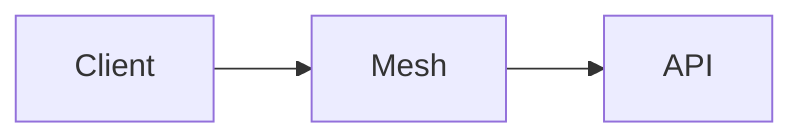

# Momentum implementation plan

Source: [SPEC.md](SPEC.md), [entity-types.tsv](entity-types.tsv), [diagrams](diagrams/), [designs](designs/pages.html)

The infrastructure is built in one pass. Work packages below are ordered by dependency, not delivered as slices.

## Technology decisions

| Area | Decision | Driven by |
|---|---|---|
| Language | TypeScript everywhere, Node 24 LTS, pnpm workspaces monorepo | Claude Code and the Claude Agent SDK are Node; one language across front-end, API, orchestrator, guard and automations |
| Front-end | Expo (React Native) with Expo Router; web target through react-native-web, served as static files by the back-end | One app, written once, deployed to web and mobile |
| Gestures | react-native-gesture-handler + react-native-reanimated | Swipe right to approve, swipe left to disapprove with a comment |
| Polling | TanStack Query with `refetchInterval`; no sockets | Front-end polls for feed items and run results; no persistent push channel |
| Markdown and diagrams | Cards rendered from markdown AST; mermaid diagrams rendered to SVG on the server by the guard, shown with react-native-svg | A card may carry a diagram; no WebView on mobile |
| Back-end | Fastify + zod, one process: API, orchestrator, consistency guard | One back-end deployable, only runs as separate processes |
| Runs | Claude Agent SDK (`@anthropic-ai/claude-agent-sdk`), one subprocess per run, cwd = the run's checkout | Claude Code as a first-class citizen; one Claude Code process per run and per project |
| Run isolation | `git worktree` per run under `C:\Projects\.runs\<workspace>\<run-id>`, branch `momentum/<automation>/<run-id>`; process started under a Windows Job Object with CPU and memory limits (procgov), killed with the job | Own checkout, own branch, isolated, killable, own resource limits |
| Knowledge base files | Markdown at `knowledge-graph/<type path>/<name>.md` on the workspace main line; frontmatter carries type, references and ranking parameters; body is the card, free-form markdown within the configured character limit | Card limit and on-disk layout fixed by the spec |
| Parser and validator | unified: remark-parse, remark-gfm, remark-frontmatter; validator enforces the configured character limit and resolves references | Validation covers the card limit and the references between entities |
| Index and metrics database | Postgres 18 in Docker on this machine (`pgvector/pgvector:pg18-trixie`), database `momentum`, one schema per workspace (`ws_<workspace>`); postgres.js driver; `tsvector` + GIN for search, pgvector for embeddings | One self-hosted store per workspace, not a managed service |
| Graph RAG retrieval | `ts_rank` full text + pgvector cosine + reference traversal over `entity_reference` (recursive CTE); embeddings computed in-process with `@huggingface/transformers` (bge-small, ONNX) | Graph RAG over entity types; no cloud service beyond the Anthropic API |
| KB access for runs | An MCP server `momentum-kb` (search, read, references, write) started by the SDK for every run | Agents and automations read and write the knowledge base freely on their own branch |
| Consistency guard | Claude Code hooks in every run: PostToolUse validates each knowledge-base write as it happens, Stop sends the run back to fix changes the guard would not accept; chokidar watch on `knowledge-graph/` of every run checkout for changes made outside the tools; a transaction is the set of changes of one run; index update per validated transaction | Reacts to every change, groups related changes, updates the index |
| Attention ranking | `product_impact`, `timeline_impact`, `unlocks` are integers 0–5 in entity frontmatter, written by the automation or user that authored the entity; `rank` computed in SQL when the index is updated | Ranking derived from the entities themselves; API reads the feed order with no work per poll |
| Cross-project feed | API merges the per-workspace `attention_ranking` tables of enabled projects by rank at request time, one `UNION ALL` across their schemas | One feed across projects, adjusting to the enabled set |
| Harness settings | Schema `harness` in the same Postgres database: enabled projects, feed size, lifetime rules, card configuration (character limit, presentation rules), concurrency, sessions | Enabling a project must not create commits in it |
| Authentication | Single user; password set at install; session token in an httpOnly cookie on web and SecureStore on mobile; API listens only on the Tailscale interface | Per-user session on top of the mesh; no port on the public internet |
| Voice tools | The API doubles as an MCP server (streamable HTTP) over the same handlers | Every capability reachable without the UI |
| Machine | This machine: Windows 11, workspaces root `C:\Projects`; back-end as a Windows service (WinSW), Tailscale for Windows, Claude Code CLI, Node via fnm | Self-hosted on the dedicated machine as it is |
| Mobile distribution | Android APK built locally with the Android SDK and sideloaded; iPhone runs the web build installed as a PWA, since iOS cannot be built on Windows | No cloud build service |
| Testing | Vitest for parser, guard, ranking and orchestrator; Playwright for the web app; the harness repository as the first workspace for end-to-end runs | The harness manages itself |

Assumed, not verified: procgov limits hold for the Claude Code subprocess tree.

## Repository layout

```
momentum/
  apps/
    app/                Expo app: web + iOS + Android
    backend/            Fastify API, orchestrator, guard, MCP surface
  packages/
    contract/           zod schemas and types shared by app and backend
    entity/             markdown parser, validator, mermaid renderer
    kb/                 Postgres index, full text, pgvector, retrieval
    runs/               Agent SDK wrapper, worktrees, job objects
  automations/          Artifacts of the definition entities: agents, skills, MCP config, one directory per automation
  knowledge-graph/      The harness's own knowledge base; Harness/Automation/ holds the definition entities
  docs/
    designs/            page designs
    diagrams/
    SPEC.md
    PLAN.md
```

A definition entity at `knowledge-graph/Harness/Automation/<name>.md` has its Claude Code files in `automations/<name>/` as artifacts; on approval of the entity they are materialized into every workspace that uses it, under `<workspace>\.claude\`.

## Entity file format

````markdown
---
type: Product/Feature
verification: unverified
sync: synced
product_impact: 4
timeline_impact: 2
unlocks: 3
references:
  - to: Governance/Decision/remote-access/private-mesh
    relation: depends_on
artifacts:
  - chats/2026-09-30-remote-access.jsonl
---
# Remote access over a private mesh

No port is exposed to the public internet; clients reach the machine through a WireGuard mesh.

- API listens only on the mesh
- One key per enrolled device

| Layer | Protection |
|---|---|
| Tunnel | End-to-end encryption |


````

Validator rules: the card body is within the configured character limit; `type` is a path from entity-types.tsv; every `references.to` resolves on the transaction's branch.

## Work packages

| # | Package | Depends on | Delivers |
|---|---|---|---|
| 0 | Machine | — | Tailscale, Node, Claude Code CLI, procgov, WinSW service, `C:\Projects` as the workspaces root, this repository as the first workspace |
| 1 | Contract | — | zod schemas for entity, feed item, run, chat, metrics, settings; generated OpenAPI |
| 2 | Entity package | 1 | Parser, validator, mermaid renderer, golden fixtures |
| 3 | KB package | 2 | Schema of the eleven tables from SPEC.md per workspace, full text, pgvector, embeddings, retrieval, `momentum-kb` MCP server |
| 4 | Runs package | 0 | Worktree lifecycle, Agent SDK session per run, job object limits, kill, usage capture from the SDK as a share of the 5-hour and weekly limits |
| 5 | Consistency guard | 2, 3, 4 | Watcher per run checkout, transaction grouping, validation, issue entities, sync state, index update, ranking |
| 6 | Orchestrator | 4, 5 | Loops per enabled project, schedule, event and on-demand triggers read from each workspace's trigger entities, feed-size bound, concurrency semaphore, chat runs |
| 7 | API | 1, 3, 6 | Session, feed, approve, send back, entities, search, chats, runs, metrics, settings; MCP surface over the same handlers |
| 8 | Automations | 3, 4 | Ten definition entities in `knowledge-graph/Harness/Automation/` with artifacts in `automations/`: exploration, preparation, consistency check, retention, implementation, validation, optimization, summarization, card, chat; a default trigger entity per automation, written into a workspace when it is enabled; materialization on approval |
| 9 | App | 1, 7 | Seven pages below, web and mobile |
| 10 | Metrics | 3, 5, 7 | Attention, understanding, agents, implementation metrics; usage as percentage points of the rolling 5-hour and weekly limits; attention patterns |
| 11 | End-to-end validation | all | The harness repository runs as a workspace on the machine: loops produce feed items, approval lands on the main line, metrics fill |

## Approval and send back

- Two independent states per entity: `verification` (unverified, verified) is the user's judgement; `sync` (synced, entity_ahead, artifact_ahead, updating) is the entity against its artifact or implementation.
- Approve: the run branch's `knowledge-graph/` changes are merged to the workspace main line, `verification` becomes `verified`, an `attention_metric` row is recorded. An implementable entity with no `implements` reference becomes `entity_ahead`: approved, awaiting implementation.
- Send back: the comment starts a chat run on the same branch with the comment as its prompt and the entity as its `target_path`; `sync` is `updating` until that run's transaction is validated. What happens to the entity is decided by the comment, not by a state.
- Implementation run: targets an `entity_ahead` entity, which is `updating` while it runs; the approved result carries an `implements` reference and both become `synced`.
- Artifact change: the guard sets `artifact_ahead` and summarization rewrites the card; `verification` is untouched until the rewrite reaches the feed.
- Implementation branches are merged by validation, not by the feed: approval of the entity and the automatic merge of the branch are separate events.

## Pages

Designs: [designs/pages.html](designs/pages.html), one PNG per page and device in [designs/](designs/).

| Page | Purpose | Source | API |
|---|---|---|---|
| Session | Establish the per-user session | Remote access | `POST /session` |
| Feed | Ranked cards across enabled projects; swipe right approves, swipe left disapproves with a comment | Attention feed, slide 2 | `GET /feed`, `POST /feed/{path}/approve`, `POST /feed/{path}/send-back` |
| Entity | One entity in full: verification, sync, type path, card, references, artifacts | Knowledge base, database | `GET /workspaces/{ws}/entities/{path}` |
| Explorer | Browse a workspace's entities by type path, including the definition and trigger entities, search them, or explore through an agent | Front-end | `GET /workspaces/{ws}/types`, `GET /workspaces/{ws}/search?q=` |
| Chat | Chats per workspace; a conversation attached to a run; steer the run or ask a question | Chat tool, Automations → Chat | `GET /workspaces/{ws}/chats`, `POST /workspaces/{ws}/chats`, `GET /runs/{id}`, `POST /runs/{id}/messages` |
| Metrics | Four metric families over time and usage as percentage points of the rolling 5-hour and weekly limits, per workspace | Index and metrics database | `GET /workspaces/{ws}/metrics` |
| Settings | Included projects, feed size, cards (character limit, presentation rules), lifetimes, agents | Slide 1, Orchestrator | `GET /settings`, `PUT /settings` |

Navigation: five tabs on mobile (Feed, Explorer, Chat, Metrics, Settings), a left rail on web. Entity and the chat conversation open from the tab they belong to. No page carries a title; the tab labels it.

## Decisions on open questions

| Question | Decision |
|---|---|
| How a workspace is added or retired | A git repository under `C:\Projects` is a workspace; deleting the directory retires it; Settings only enables or disables |
| Dedicated agents beyond the automations | None; sub-agents are artifacts of the definition entities, proposed by the optimization automation |
| Where user edits of automations land | Definitions are entities at `knowledge-graph/Harness/Automation/<name>` in the harness workspace, with the Claude Code files in `automations/<name>/` as artifacts; triggers are entities at `knowledge-graph/Harness/Trigger/<name>` in each workspace. Edits and proposals go through a branch, the guard and the feed; the orchestrator reads triggers from each workspace's index; materialization runs on approval of a definition |
| Form of validation per kind of work | Chosen by the validation automation from the change's entity type; the four forms are review, test suite run, exploratory pass, consistency check |
| Sync with sources | Runs read the repository directly; the summarization step writes summaries from artifacts on the run branch |
| Claude Code integration surface | Agent SDK for runs, `momentum-kb` MCP for the knowledge base, definitions materialized under `<workspace>\.claude\` on approval |
| Offline mobile | Last polled feed and entities cached by TanStack Query; reactions queue until the mesh is reachable |

Still open: how the attention ranking is tuned and measured; scale, latency and usage targets.
