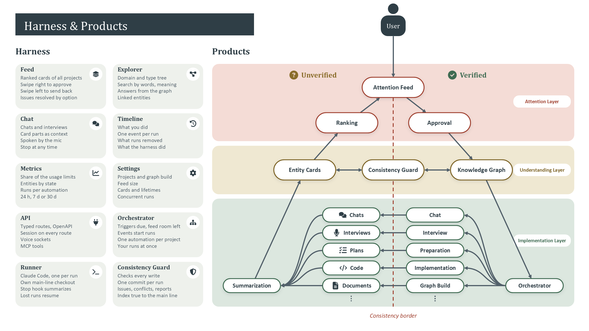
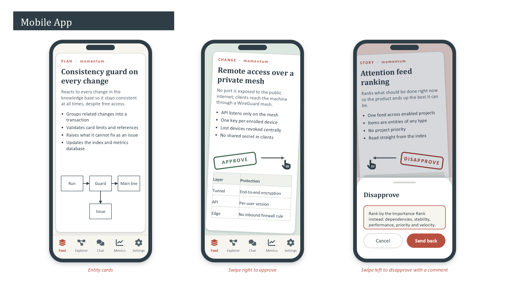

# Momentum harness

## Purpose

- Boosts the performance of the work done around a project
- The orchestrator and single entry point between the user and that work, for any project in any workspace
- A consistent, concise layer over whatever lies underneath, so a project is explored through entities instead of raw artifacts

## Dictionary

- **API**: Entry point between the front-end and the agents
- **Approved state**: The system itself; approval makes a change part of it, and anything unapproved sits outside the project
- **Attention feed**: A single feed where everything that needs the user's attention shows up; its items are entities, of any type
- **Automation**: A background loop, per project, defined by its responsibility alone; its definition is an entity in the harness workspace, its triggers an entity in each project
- **Attention ranking**: The feed order, derived from the entities themselves by impact on the product, impact on the timeline, and how much the work unlocks
- **Card**: The concise representation of an entity, written by the card automation; no fixed structure, only a configured character limit, in the form that presents the entity best
- **Card automation**: Writes the card of every entity by the user's configuration; the configuration sets at least a character limit sized so a card fits on a mobile screen
- **Chat tool**: Asks a question or steers a run directly, without waiting for the feed
- **Consistency guard**: Reacts to every change in the knowledge base, groups related changes into a transaction and validates them before they land on the main line
- **Dedicated machine**: The one resource-rich machine that runs the back-end, the agents and the knowledge base
- **Definition**: The Claude Code definition an automation runs; an entity in the harness workspace's knowledge base, one per automation, whose artifacts are the agent, skill, sub-agent and MCP files; edited, proposed and approved like any other entity
- **Enabled project**: A project the orchestrator schedules; a disabled project has no loops running for it
- **Entity**: The unit of the knowledge base, shown as a card; standalone, with a type, an origin and a state
- **Entity type**: A path; all entities of the same type share a directory
- **Front-end**: One app, written once and deployed to both web and mobile
- **Goal**: An entity in a workspace's knowledge base that guides exploration
- **Harness**: The orchestrator and single entry point between the user and the work around a project
- **Index and metrics database**: The queryable side of the knowledge base: indices over entities, automations and chats, plus the metrics collected about them
- **Knowledge base**: Graph RAG over many different entity types, one per workspace
- **Layers**: Attention (ranked feed, approval), understanding (entities, index), implementation (automations, runs, validation)
- **Lifetime**: How long an entity earns its place on the main line, set by rules per entity type
- **Main line**: Where a change counts, once the guard has validated it and the user has approved it
- **Mapping**: The automation that builds the knowledge graph of a workspace from its repository; starts when the project is enabled, bounded by the feed like every loop, until the repository is covered or the user stops it
- **Origin**: How an entity came to be: added by the user, requested by the user and written by an automation, or raised by an automation on its own
- **Orchestrator**: Starts and supervises the background automation loops, per project
- **Run**: One Claude Code process per run and per project, in its own checkout of the project repository, on its own branch
- **Summary**: The flavour of entity that has underlying artifacts, written by summarization; given a card like any other entity
- **Transaction**: A group of related changes the consistency guard validates together
- **Trigger**: What starts a run of an automation: a schedule, an event, or the user on demand; an entity in each workspace's knowledge base, one per automation
- **Workspace**: A project; a git repository on the dedicated machine, with its own knowledge base

## Success criteria

The harness earns its place only if it boosts the user's performance instead of costing attention.

- Consistency grows across every project it touches
- Work arrives as one consistent piece, not as fragments the user has to assemble
- The system is flexible enough that it does not need constant modification to keep working

## Workspaces and projects

A project is a workspace, and a workspace is a git repository on the dedicated machine; all workspaces sit side by side under one root directory. Nothing is registered elsewhere; what lives on disk is what the system works on.

- Each workspace carries its own knowledge base, built on the same entity structure
- Goals are entities in that knowledge base, so the automations read them the same way they read everything else
- Goals arrive by every route: written in the chat tool, edited directly as entities, or proposed by an automation for the user to approve
- The harness manages itself: its own repository is one of the workspaces, with its own goals and knowledge base
- Single user by design: a workspace is never shared
- Projects stay isolated: no entities, findings or knowledge cross from one workspace into another
- Between 5 and 20 projects are expected to be enabled at once, with their loops running in parallel

## Components

Three layers carry the user: attention on top, understanding beneath it, implementation at the base.

The same three layers, cut by the workspaces they run in: the attention layer is shared; everything beneath it exists once per project.

### Front-end

- One app, written once and deployed to both web and mobile
- Three ways into a project: the attention feed, a separate chat tool, and direct exploration of the entity layer
- The chat tool asks a question or steers a run directly, without waiting for the feed
- The entity layer is browsable and searchable on its own: the user walks the project card by card, or explores it through an agent

### Back-end

#### API

- Entry point between the front-end and the agents
- The front-end polls for new feed items and for the results of long-running runs; no persistent push channel, as changes are infrequent enough for polling

#### Orchestrator

Starts and supervises the background automation loops, per project. It ships in the same application as the API: one back-end deployable, with only the runs as separate processes.

- Owns the schedule and lifecycle of every loop run, started by the trigger entities of each enabled project: a schedule, an event, or on demand
- The feed size bounds the loops: they keep producing until the feed reaches its limit, then pause until the user works it down
- Only enabled projects are scheduled: a disabled project falls out of the orchestrator's control entirely, and no loops run for it
- Enabling a project starts the mapping: the knowledge graph is built from the repository run after run, each run bounded by the room the feed has, until the repository is covered; the user watches what the build has used and stops it at any time, and disabling the project stops it too
- Resetting a project removes every entity and database entry it has and starts the build afresh: every run ends, the run branches go, the knowledge graph leaves the main line in one commit, and the project is enabled again from nothing; the harness workspace, which holds the automation definitions, cannot be reset
- Every run is a separate process: one Claude Code process per run and per project
- Each run process works in its own checkout of the project repository, on its own branch, so concurrent runs never share a working tree
- Runs are isolated and killable, with their own resource limits; a crashing or heavy run cannot take the orchestrator down
- Every run shows what it has used so far while it runs, and the user can kill any run from the chat tool; what a killed run wrote still passes the guard and reaches the feed, so nothing lands unattended
- Concurrency is configurable: several runs may be active for one project, bounded by the Anthropic API limits and tuned from measured behaviour rather than fixed upfront

#### Knowledge base

- Graph RAG over many different entity types
- The full list of entity types lives in a separate document: [Entity types](entity-types.tsv)
- The unit is the entity; it is standalone and needs no artifact behind it
- A summary is a flavour of entity: an entity with underlying artifacts, written by summarization
- Entities arrive by three origins: added by the user directly, requested by the user and written by an automation, or raised by an automation on its own; every origin reaches the main line through the feed
- Every entity is shown as a card, written by the card automation; a card has no fixed structure
  - The user configures how cards are written; the one rule the configuration always sets is a character limit
  - The limit is sized so a card fits on a mobile screen; within it a card can be anything
  - The form follows the entity type and the underlying artifact types: a paragraph, bullets, a table or a diagram, whichever presents the entity best
- An entity that cannot be described within the limit is split into several entities that reference each other
- Entities live on disk in a file structure that mirrors their types: a type is a path, so all entities of the same type share a directory
- Chats are resources: each is stored and indexed as a summary, with the chat as its artifact
- Actions are entities as well, so failures, conflicts and resolutions reach the attention feed by the same path as everything else
- Agents and automations read and write the knowledge base freely on their own branch; nothing gates work in progress
- The gate is at the main line: a change counts only once the guard has validated it and the user has approved it
- No separate ingestion component: the automations read the sources themselves, and summarization turns repository artifacts into summaries

##### Consistency guard

Reacts to every change in the knowledge base so it stays consistent at all times, despite free access.

- Groups related changes into a transaction and validates them before they land on the main line
- Validation covers the configured card limit and the references between entities
- Changes that cannot be made consistent are raised as issues, the same way the consistency check loop reports them
- Runs on every change, not only on the scheduled consistency check
- Updates the index and metrics database as part of every validated transaction
- Maintains each entity's sync state: sets `updating` when a run targets it, `artifact_ahead` when its artifact changes, `entity_ahead` when it is approved without an implementation, and `synced` once they agree

##### Index and metrics database

The queryable side of the knowledge base: indices over entities, automations and chats, plus the metrics collected about them.

- Lives alongside the entities on the dedicated machine: each workspace carries its own store, not a separate managed service
- Kept up to date by the consistency guard, on every change
- Holds four families of metrics, each tracked over time so trends are visible, and all of them fed to the optimization automation:
  - Attention: time the user spends per item, what is approved, rejected or sent back, and the patterns regular enough to become automatic approval or rejection
  - Understanding: how consistent the knowledge base is and how that consistency moves
  - Agents: misalignments found in chats, issues that recur, and how the automations behave run over run
  - Implementation: the state of the project itself: outstanding issues, bugs and defects
- Tracks usage continuously: consumption is known at any moment, as percentage points of the rolling 5-hour and weekly limits, per workspace and per run
- Holds the attention ranking, computed as the indices are updated; the API reads the ranking and the feed order straight from it, with no work per poll

#### Automations

Automations run continuously in the background, per project, independently of the user, preparing work ahead of time.

No entity type belongs to an automation. Each automation is defined by its responsibility alone and searches the whole knowledge base across every layer, picking whatever entities serve that responsibility.

The user configures every automation through the knowledge base, not through settings. The definition is an entity in the harness workspace, one per automation, with the Claude Code files as its artifacts; the triggers are an entity per automation in each workspace, holding its schedule, its events and whether it starts on demand. Both are edited, proposed and approved like any other entity: the user's edit or optimization's proposal lands on a branch, passes the guard and reaches the main line through the feed. An automation that runs as a step inside the others has no trigger entity.

AI is not the default. Each responsibility is split into steps and every step is carried by the cheapest mechanism that can carry it: indices, metrics, lifetimes and references are queries and rules, not prompts. AI is reserved for the judgement that cannot be expressed that way — deciding, planning, reviewing, summarizing.

- Exploration
  - Decides the next best action for the project
  - Researches and collects the information needed for that decision
  - Is guided by the workspace's goals and works within them rather than setting them
  - A project whose goals are all met goes idle
- Preparation
  - Finds tasks, issues, research and other action points that can be started
  - Prepares plans for the user to accept
  - Plans are summaries too, so they stay short and quick to read and approve
- Consistency check
  - Runs as a background loop and on demand
  - Checks consistency across all entities in the knowledge base
  - Reports several kinds of issues, each raised as its own entity for the user to react to
- Retention
  - Every entity has a lifetime: a task resolved a month ago or research long since delivered no longer earns its place on the main line
  - Rules per entity type rather than a fixed TTL: what counts as spent depends on the type and on what still references it
  - Runs as a background loop that proposes what to retire, and the removal reaches the approved state through the feed like any other change
- Implementation
  - A regular Claude Code automation/chat
  - Work lands on its own branch, never on the main line directly
  - The branch is merged automatically once validation passes
- Validation
  - Validates the product, not only the change: an implementation change triggers a run, and a background loop validates the project as it stands
  - The background runs are regression and exploratory testing, so defects surface without a change to prompt them
  - The form depends on the work: a review of the changes, a test suite run, an exploratory pass, or a consistency check
  - Gates the merge: only a verified branch is merged back, and a failed validation raises an issue entity that holds the branch until it is resolved
  - A branch that cannot be merged raises a conflict or merge resolution entity, carrying its own priority and waiting for the user's approval
- Optimization
  - Analyzes chats for misalignments with the user and issues that came up
  - Finds resolutions for the issues that recur most often: skills, sub-agents, definitions, new tools or MCP servers
  - Proposes changes to the definition and trigger entities through the feed; the user edits the same entities directly
  - Definitions, skills and sub-agents belong to the harness workspace's knowledge base, so their behaviour can be measured across every project
  - Each approved definition is materialized into the workspaces that use it, so Claude Code picks it up locally with no indirection
  - Competing implementations of a skill or sub-agent are compared on the collected metrics
- Summarization
  - Summarizes artifacts from the repository: chats, plans, results implemented by AI
  - Runs as a step inside the other automations, so none of them is limited by how much it can read
  - Writes each summary before the user reads the work
  - Each summary is an entity like any other, a separate markdown document, at `knowledge-graph/type/sub-type/parent-name/name`
- Card
  - Writes the card of every entity, following the user's configuration
  - The configuration sets at least a character limit, sized so a card fits on a mobile screen; it may say more about how cards are written, but never prescribes a fixed structure
  - Chooses the form per entity type and per underlying artifact type, so the presentation is the best one for what lies behind the card
  - Runs as a step inside the other automations, like summarization, so every entity has its card before it reaches the feed
- Chat
  - The direct chat is an automation too, started by the user instead of by the schedule
  - Runs on the same machinery as every other automation: its own process, checkout and branch
  - Can do anything the other automations can; its results reach the approved state through the feed like any other change
- Mapping
  - Builds the knowledge graph of a workspace from its repository, so the project can be explored through entities from the start
  - Started by enabling the project rather than by a trigger entity; one run at a time, each writing at most the room the feed has
  - Every run of a workspace continues on the same branch and reports its progress to the next; the build ends when a run reports the repository covered, or when the user stops it
  - The user watches the runs, the entities, the time and the usage of the build as it goes, with the full build estimated from the share of the repository the runs report covered, and stops it when it costs too much or maps the project wrongly; the entities it wrote wait in the feed like any other change

#### Attention feed

A single feed where everything that needs the user's attention shows up.

- The user verifies, approves or sends back each item; a reaction takes any form the item needs: a change request, a split into several entities, or new entities alongside it
- Nothing changes unattended: every change surfaces as an entity, a summary of an artifact, a feature, a result, and passes the user's eyes before it counts
- The approved state is the system: approval is what makes a change part of it, and anything unapproved sits outside the project
- Items are entities, of any type
- Counters above the cards show the entities of the enabled projects by state: verified and unverified, and each sync state
- One feed across projects: projects are enabled or disabled on demand and the feed adjusts to the enabled set
- Ranking answers one question: what should be done right now so the product ends up the best it can be and the journey there stays optimal
- A few parameters decide it, each measuring how much the work behind the entity matters: impact on the product, impact on the timeline, and how much it unlocks
- So a prioritized feature request, an optimization that compounds into future work, a refactoring that cannot wait and a pending exploration compete on the same scale
- No project priority: ranking is derived from the entities themselves, not from a rank assigned to a workspace

## Database

Tables of the [index and metrics database](#index-and-metrics-database), one store per workspace, updated by the consistency guard on every validated transaction.

### entity

| Field | Description |
|---|---|
| path | Location on disk, `knowledge-graph/type/sub-type/parent-name/name` |
| type | Entity type; the directory shared by all entities of that type |
| title | Title |
| card | The card, within the configured character limit |
| origin | user, requested or automation |
| verification | unverified or verified: the user's judgement of the entity |
| sync | synced, entity_ahead, artifact_ahead or updating: the entity against its underlying artifact or implementation |

An entity with at least one row in `entity_artifact` is a summary; there is no flavour column.

The two states are independent. Verification belongs to the attention layer; rejection is a process, not a value. Sync belongs to the implementation layer and is maintained by the consistency guard:

| sync | Meaning |
|---|---|
| synced | Entity, artifact and implementation agree; a standalone entity with no artifact and no `implements` reference is always synced |
| entity_ahead | The entity is approved but nothing implements it yet: a verified feature or plan awaiting implementation |
| artifact_ahead | The artifact changed under the entity; summarization rewrites the card |
| updating | A run is working on the entity, for example after a send back; replaces the former pending_update |

### entity_artifact

| Field | Description |
|---|---|
| entity_path | Summary written from the artifact |
| artifact_path | Repository artifact behind the summary, such as a chat, a plan or a result implemented by AI |

### entity_reference

| Field | Description |
|---|---|
| from_path | Entity holding the reference |
| to_path | Entity referenced; validated by the guard, read by retention to decide what is spent |
| relation_type | Type of relation between the two entities; `implements` links a result to the entity it implements and is what sync compares against |

### chat

| Field | Description |
|---|---|
| entity_path | Summary the chat is stored and indexed as; the chat is its artifact |
| run_id | Chat automation run the chat belongs to |

### automation

| Field | Description |
|---|---|
| name | Exploration, preparation, consistency check, retention, implementation, validation, optimization, summarization, card, chat or mapping |
| responsibility | Responsibility that defines the automation |
| definition | Path of the definition entity in the harness workspace |
| trigger | Path of the trigger entity in this workspace; none for an automation that runs only as a step inside others |

### run

| Field | Description |
|---|---|
| id | One Claude Code process per run and per project |
| automation | Automation the run belongs to |
| branch | Own branch of the run |
| checkout | Own checkout of the project repository |
| trigger | Trigger that started the run: schedule, event or on demand |
| target_path | Entity the run is working on, if any; that entity is `updating` while the run lasts |
| usage | Share of the rolling 5-hour and weekly limits the run has used so far, in percentage points, updated while it runs |

### attention_ranking

| Field | Description |
|---|---|
| entity_path | Entity in the feed |
| product_impact | Impact on the product |
| timeline_impact | Impact on the timeline |
| unlocks | How much the work unlocks |
| rank | Feed order, read by the API with no work per poll |

### attention_metric

| Field | Description |
|---|---|
| entity_path | Feed item |
| time_spent | Time the user spends on the item |
| reaction | Approved, rejected or sent back |
| recorded_at | Time of measurement |

### attention_pattern

| Field | Description |
|---|---|
| pattern | Reaction pattern regular enough to automate |
| outcome | Automatic approval or rejection |

### understanding_metric

| Field | Description |
|---|---|
| consistency | How consistent the knowledge base is |
| recorded_at | Time of measurement |

### agent_metric

| Field | Description |
|---|---|
| run_id | Run measured, for comparison run over run |
| misalignments | Misalignments with the user found in chats |
| recurring_issues | Issues that recur |
| variant | Skill or sub-agent variant in use, for comparing competing implementations |
| usage | Share of the rolling 5-hour and weekly limits used by the run, in percentage points |
| recorded_at | Time of measurement |

### implementation_metric

| Field | Description |
|---|---|
| outstanding_issues | Outstanding issues |
| bugs | Bugs |
| defects | Defects |
| recorded_at | Time of measurement |

## Implementation

No stack is fixed. The choice is driven by constraints, not by a preferred technology. The infrastructure is built in one pass rather than delivered as incremental slices.

- The back-end runs Claude Code as a first-class citizen: its automations, definitions and tooling are native to the runtime, not wrapped around it
- Every capability is reachable through the user's voice tools, so the system can be driven without the UI

### Deployment

- Self-hosted: the back-end, the agents and the knowledge base run on one dedicated, resource-rich machine
- No cloud services; nothing is offloaded to a managed runtime
- The web and mobile clients connect to that machine over the network

#### Remote access

No port is exposed to the public internet. Clients reach the machine through a private mesh network (WireGuard, e.g. via Tailscale), so the API listens only on that network's interface.

- Each device is enrolled once and carries its own key; a lost device is revoked centrally
- Traffic is encrypted end to end by the tunnel; the API additionally requires a per-user session
- No inbound firewall rule, no reverse proxy on the public edge, no shared secret in the clients

## Open questions

- How a workspace is added or retired
- Whether any dedicated agents are needed beyond the automations
- Which form validation takes for each kind of work
- How the attention ranking is tuned and measured
- How the knowledge base stays in sync with its sources (repositories, issues, chats)
- The integration surface with Claude Code: skills, sub-agents, tools and MCP servers
- Scale, latency and usage targets, and what the mobile app does offline
