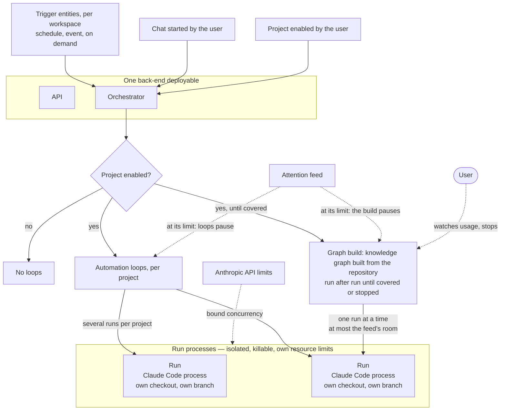

# Orchestrator and runs

Source: [SPEC.md → Orchestrator](../SPEC.md#orchestrator), [Automations → Chat](../SPEC.md#automations)

```mermaid
flowchart TB
  Trig["Trigger entities, per workspace<br/>schedule, event, on demand"]
  Demand["Chat started by the user"]
  Enable["Project enabled by the user"]
  subgraph Backend["One back-end deployable"]
    API["API"]
    Orch["Orchestrator"]
  end
  Enabled{"Project enabled?"}
  NoLoops["No loops"]
  Loops["Automation loops, per project"]
  GraphBuild["Graph build: knowledge graph built from the repository<br/>run after run until covered or stopped"]
  subgraph Procs["Run processes — isolated, killable, own resource limits"]
    R1["Run<br/>Claude Code process<br/>own checkout, own branch"]
    R2["Run<br/>Claude Code process<br/>own checkout, own branch"]
  end
  Feed["Attention feed"]
  Limits["Anthropic API limits"]
  Trig --> Orch
  Demand --> Orch
  Enable --> Orch
  Orch --> Enabled
  Enabled -->|"no"| NoLoops
  Enabled -->|"yes"| Loops
  Enabled -->|"yes, until covered"| GraphBuild
  Loops -->|"several runs per project"| R1
  Loops --> R2
  GraphBuild -->|"one run at a time<br/>at most the feed's room"| R2
  Limits -. "bound concurrency" .-> Procs
  Feed -. "at its limit: loops pause" .-> Loops
  Feed -. "at its limit: the build pauses" .-> GraphBuild
  User(["User"]) -. "watches usage, stops" .-> GraphBuild
```
