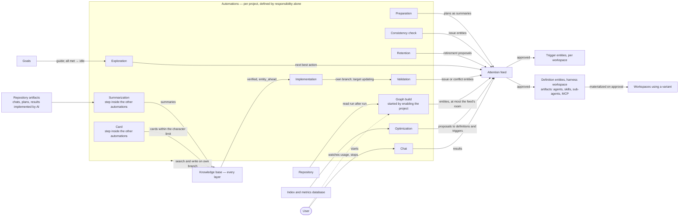
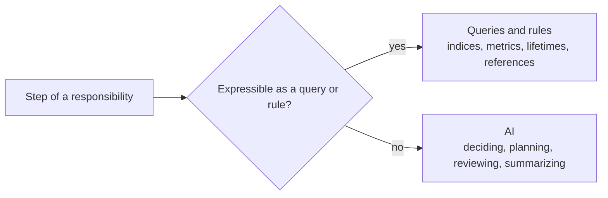

# Automations

Source: [SPEC.md → Automations](../SPEC.md#automations)

```mermaid
flowchart LR
  KB["Knowledge base — every layer"]
  Goals["Goals"]
  Feed["Attention feed"]
  Artifacts["Repository artifacts<br/>chats, plans, results implemented by AI"]
  Repo["Repository"]
  Metrics["Index and metrics database"]
  HarnessRepo["Definition entities, harness workspace<br/>artifacts: agents, skills, sub-agents, MCP"]
  Triggers["Trigger entities, per workspace"]
  Workspaces["Workspaces using a variant"]
  User(["User"])
  subgraph Auto["Automations — per project, defined by responsibility alone"]
    Exploration["Exploration"]
    Preparation["Preparation"]
    Consistency["Consistency check"]
    Retention["Retention"]
    Implementation["Implementation"]
    Validation["Validation"]
    Optimization["Optimization"]
    Summarization["Summarization<br/>step inside the other automations"]
    Card["Card<br/>step inside the other automations"]
    Chat["Chat"]
    GraphBuild["Graph build<br/>started by enabling the project"]
  end
  Auto <-->|"search and write on own branch"| KB
  Goals -->|"guide; all met → idle"| Exploration
  Exploration -->|"next best action"| Feed
  Preparation -->|"plans as summaries"| Feed
  Consistency -->|"issue entities"| Feed
  Retention -->|"retirement proposals"| Feed
  KB -->|"verified, entity_ahead"| Implementation
  Implementation -->|"own branch; target updating"| Validation
  Validation -->|"issue or conflict entities"| Feed
  Artifacts --> Summarization
  Summarization -->|"summaries"| KB
  Card -->|"cards within the character limit"| KB
  Metrics --> Optimization
  Optimization -->|"proposals to definitions and triggers"| Feed
  Feed -->|"approved"| HarnessRepo
  Feed -->|"approved"| Triggers
  HarnessRepo -->|"materialized on approval"| Workspaces
  User -->|"starts"| Chat
  Chat -->|"results"| Feed
  Repo -->|"read run after run"| GraphBuild
  GraphBuild -->|"entities, at most the feed's room"| Feed
  User -. "watches usage, stops" .-> GraphBuild
```

## Step mechanism

```mermaid
flowchart LR
  Step["Step of a responsibility"]
  Q{"Expressible as a query or rule?"}
  Rules["Queries and rules<br/>indices, metrics, lifetimes, references"]
  AI["AI<br/>deciding, planning, reviewing, summarizing"]
  Step --> Q
  Q -->|"yes"| Rules
  Q -->|"no"| AI
```
