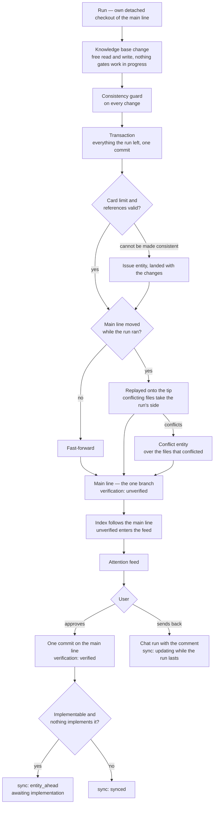
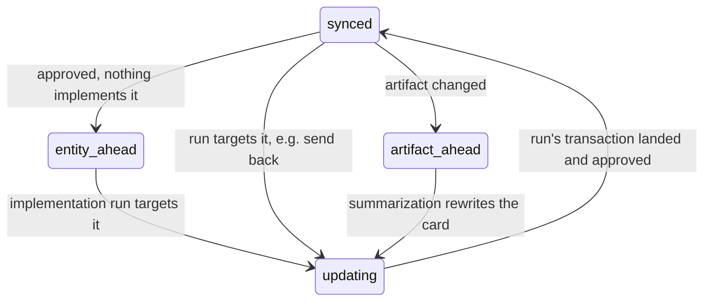

# Change to main line

Source: [SPEC.md → Knowledge base](../SPEC.md#knowledge-base), [Consistency guard](../SPEC.md#consistency-guard), [Attention feed](../SPEC.md#attention-feed), [Database → entity](../SPEC.md#entity)

A plan is an ordinary entity on this path: approved, it stands `entity_ahead` until implemented.

## Sync state

Maintained by the consistency guard, independent of verification.

