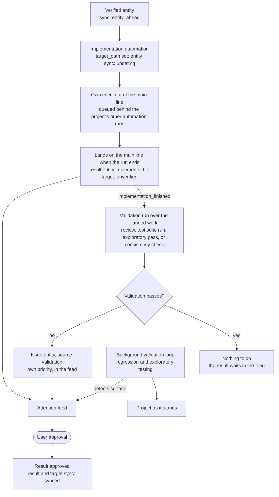

# Implementation and validation

Source: [SPEC.md → Automations: Implementation, Validation](../SPEC.md#automations), [Database → entity](../SPEC.md#entity)

Nothing is merged and nothing is held: the work is on the main line as soon as the run ends, and what validation finds reaches the user as issues.
