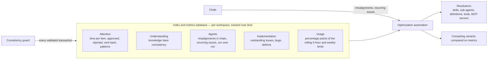

# Metrics and optimization

Source: [SPEC.md → Index and metrics database](../SPEC.md#index-and-metrics-database), [Automations: Optimization](../SPEC.md#automations)

```mermaid
flowchart LR
  Guard["Consistency guard"]
  subgraph DB["Index and metrics database — per workspace, tracked over time"]
    Att["Attention<br/>time per item, approved, rejected, sent back, patterns"]
    Und["Understanding<br/>knowledge base consistency"]
    Ag["Agents<br/>misalignments in chats, recurring issues, run over run"]
    Imp["Implementation<br/>outstanding issues, bugs, defects"]
    Usage["Usage<br/>percentage points of the rolling 5-hour and weekly limits"]
  end
  Opt["Optimization automation"]
  Chats["Chats"]
  Res["Resolutions<br/>skills, sub-agents, definitions, tools, MCP servers"]
  Compare["Competing variants compared on metrics"]
  Guard -->|"every validated transaction"| DB
  DB --> Opt
  Chats -->|"misalignments, recurring issues"| Opt
  Opt --> Res
  Opt --> Compare
```
