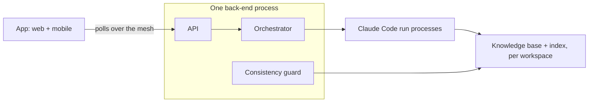

# Momentum harness system

Three layers: attention on top (ranked feed and approval, shared across projects), understanding beneath (entities and index), implementation at the base (automations, runs, validation); the lower two exist once per project.

