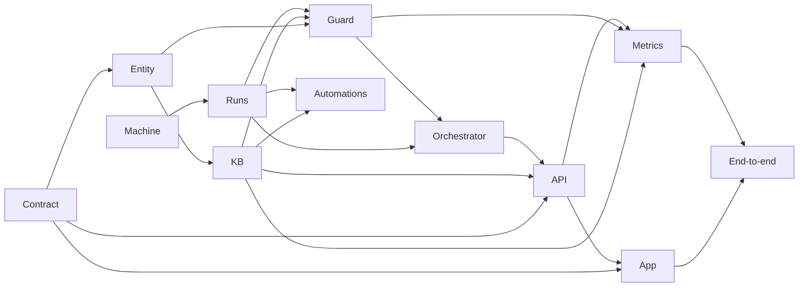

# Momentum implementation plan

Builds the harness in one pass: twelve work packages ordered by dependency, from SPEC.md, entity types, diagrams and page designs.

Still open: tuning and measuring the attention ranking; scale, latency and usage targets. Assumed, not verified: procgov limits hold for the Claude Code subprocess tree.
