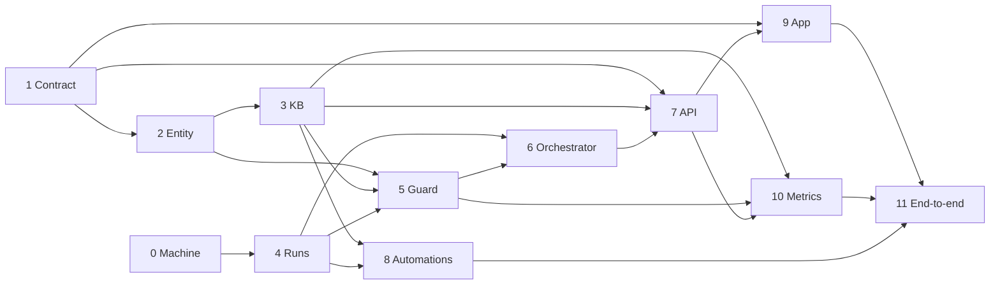

# Plan: work packages

- 7 API: session, feed reactions (approve, send back, resolve, won't resolve), entities, chats, runs, metrics, settings; MCP over the same handlers
- 8 Automations: ten definitions; default triggers for eight (not summarization, run by the Stop hook, nor graph build, started on enabling)
- 11: this repository runs as a live workspace
