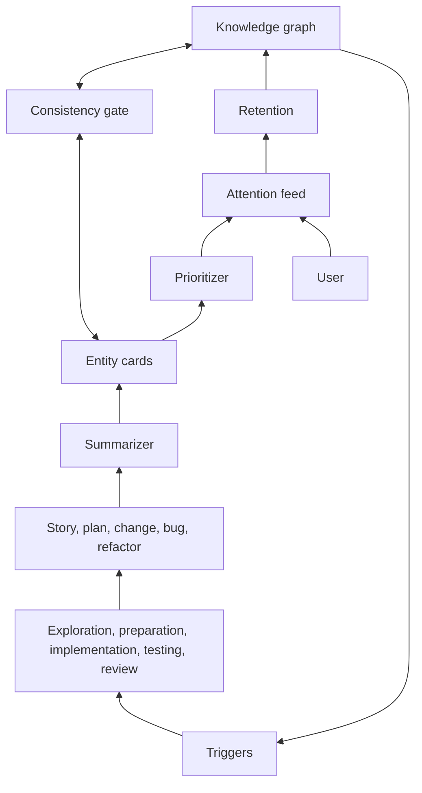

# Components

Harness and products. The user enters through the attention feed. Three layers: attention (shared), knowledge and product (per project); a consistency border splits unverified from verified.

Harness: settings, graph explorer, importance rank, chat, metrics, optimization, orchestrator, API, voice tools, RAG.
