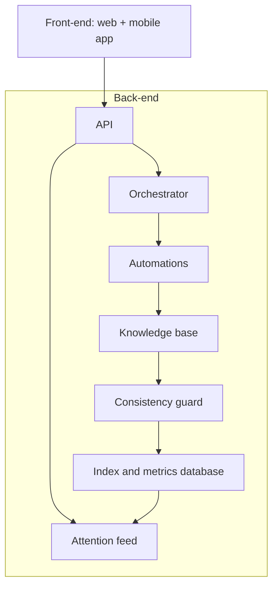

# Components

Three layers carry the user: attention on top, understanding beneath, implementation at the base. The attention layer is shared; everything beneath exists once per project.

```mermaid
flowchart TD
  FE[Front-end: web + mobile app] --> API
  subgraph Back-end
    API --> ORC[Orchestrator]
    API --> FEED[Attention feed]
    ORC --> AUT[Automations]
    AUT --> KB[Knowledge base]
    KB --> G[Consistency guard] --> DB[Index and metrics database]
    DB --> FEED
  end
```
