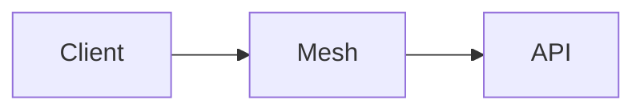

# Remote access over a private mesh

No port is exposed to the public internet; clients reach the machine through a WireGuard mesh.

- API listens only on the mesh
- One key per enrolled device

| Layer | Protection |
|---|---|
| Tunnel | End-to-end encryption |

